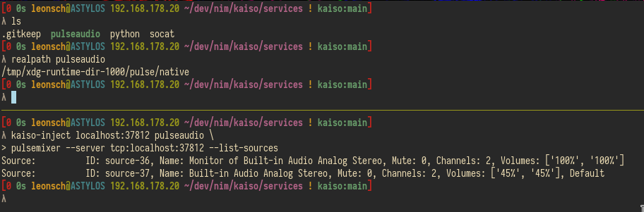
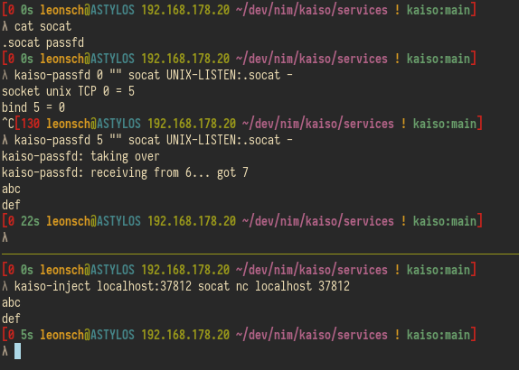
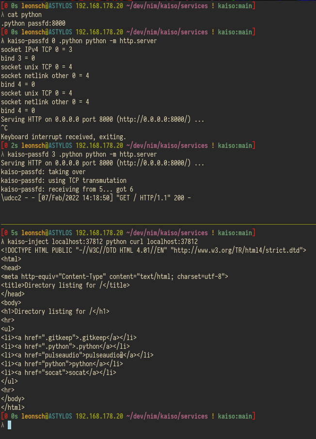

# kaiso - A TCP service router
Kaiso allows for many services to be offered on the same port.

A client can send an empty line (CRLF) to request a list of services
or a line containing such a service path to connect to that service.
Kaiso will then forward all data between the client socket and
a new connection to the targeted service.

Services are available to kaiso in the form of UNIX domain sockets
that are placed somewhere below the `services` directory.

## Additional tools
Expose is the inverse function of kaiso: it exposes a kaiso service on a port,
thus allowing programs to interact with this service without speaking the kaiso protocol.

kaiso-inject is a wrapper for clients to connect to a service behind kaiso.
It targets the `connect(2)` function and injects the service path
when a connection to the kaiso IP and port occurs.

kaiso-passfd is a wrapper for servers to enable passing of client file descriptors.
This enables direct connection between client and service,
therefore data transfer speed is not limited by kaiso.
kaiso-passfd is an advanced tool that will probably not work with every server.
Its basic prerequisites are:
- The file descriptor of the listener socket must not be random
- The server must use a UNIX or TCP socket as the listener

## Examples
A client (netcat) connecting to the `foo` service.
These error messages of kaiso are informative; they occur on disconnection.

Connection via `expose`

Connection via `kaiso-inject`

Socat listening on a UNIX socket with passfd active

The simple python webserver with passfd and TCP transmutation active

