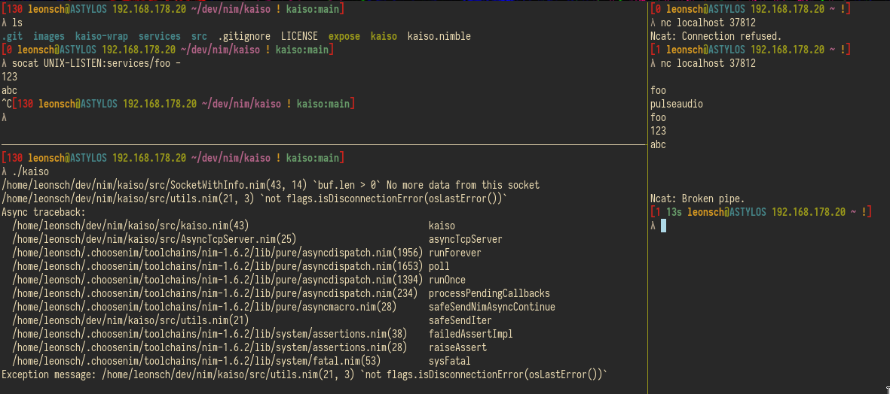
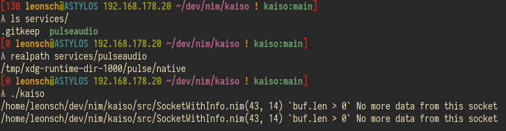
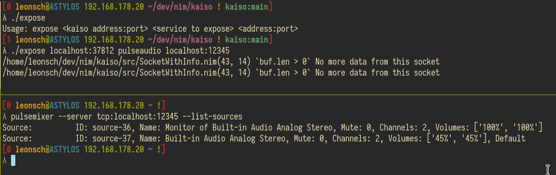
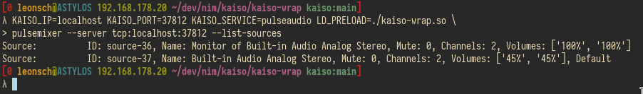

# kaiso - A TCP service router
Kaiso allows for many services to be offered on the same port.

A client can send an empty line (CRLF) to request a list of services
or a line containing such a service path to connect to that service.
Kaiso will then forward all data between the client socket and
a new connection to the targeted service.

Services are available to kaiso in the form of UNIX domain sockets
that are placed somewhere below the `services` directory.

## Additional tools
Expose is the inverse function of kaiso: it exposes a kaiso service on a port,
thus allowing programs to interact with this service without speaking the kaiso protocol.

kaiso-wrap is a dynamic library for use with LD_PRELOAD.
It targets the `connect(2)` function and injects the service path
when a connection to the kaiso IP and port occurs.
It is configured via the environment variables `KAISO_IP`, `KAISO_PORT` and `KAISO_SERVICE`

## Examples
A client (netcat) connecting to the `foo` service.
These error messages of kaiso are informative; they occur on disconnection.

Symlinks to sockets also work, shown here with pulseaudio

Connection via `expose`

Connection via `kaiso-wrap`

